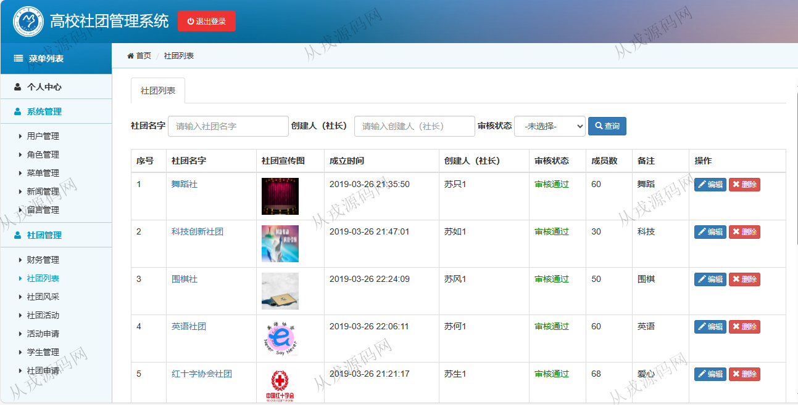

<h1 align="center">97.高校社团管理系统</h1>

 获取sql文件 QQ: 386869957 QQ群: 377586148 

 [推荐站点: 从戎源码网](https://armycodes.com/) 

## 简介

> 本代码来源于网络,仅供学习参考使用!
>
> 提供1.远程部署/2.修改代码/3.设计文档指导/4.框架代码讲解等服务
> 
> 用户端首页：http://localhost:8080/team/f?action=index
> 
> 用户：stu2 123456
> 
> 管理后台：http://localhost:8080/team/mui/login.jsp
> 
> 管理员：sys 123456
>

## 项目介绍
基于jsp+servlet的高校社团管理系统：有配套报告文档，前端 jsp、jquery、bootstrap，后端 servlet、jdbc，角色分为管理员、用户；集成社团展示、社团风采、社团活动、在线申请等功能于一体的系统。

## 功能介绍

### 用户

- 基本功能：登录、注册、安全退出
- 个人中心：个人信息查看与修改，成立社团，我的社团，申请加入社团，申请参加社团
- 网站首页：导航栏，公告，最新活动，最新新闻，社团风采，社团列表滚动展示，推荐活动
- 社团列表：社团列表导航展示，社团详情页面
- 社团风采：社团风采主题文章，标题搜索
- 社团活动：活动列表展示，活动详情，活动在线申请
- 新闻列表：新闻列表展示，新闻详情页面
- 留言：在线留言发布

### 管理员

- 财务管理：财务信息的增删改查，条件查询
- 社团管理：社团列表查询，编辑，删除，支持富文本编辑，社团审核通过与不通过
- 社团风采：风采信息的增删改查
- 社团活动：活动信息的增删改查，审核机制，申请列表查看，申请信息的编辑与删除
- 活动申请：申请信息列表查询，编辑与删除
- 学生管理：学生信息的增删改查
- 社团申请：社团信息列表查询，审核，删除

## 环境

- <b>IntelliJ IDEA 2009.3</b>

- <b>Mysql 5.7.26</b>

- <b>Tomcat 7.0.73</b>

- <b>JDK 1.8</b>

## 运行截图

